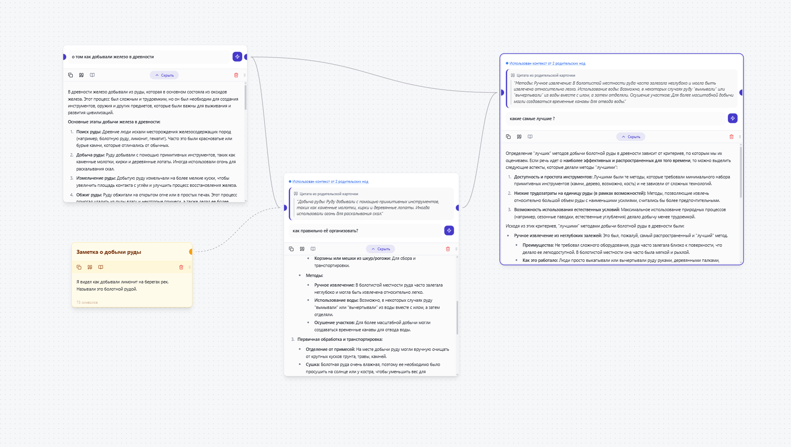
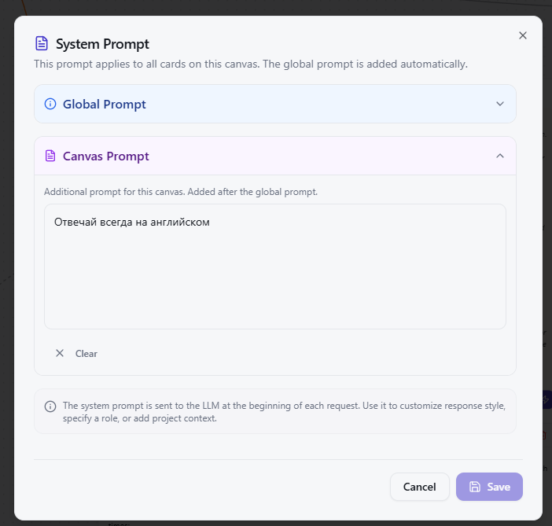
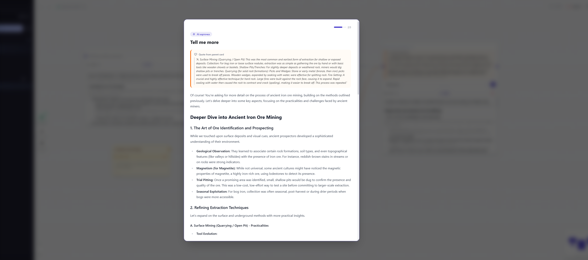
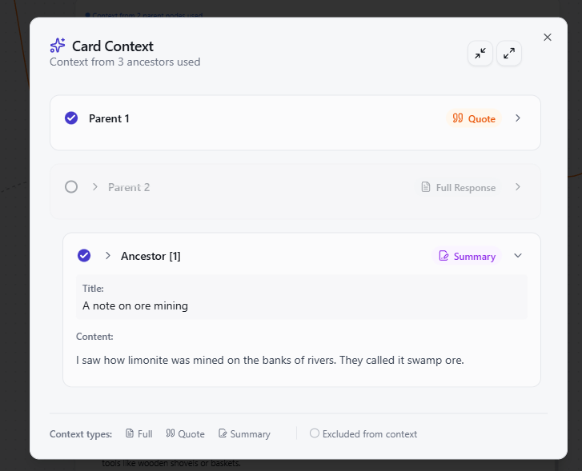

<p align="center">
  
</p>

<h1 align="center">🧠 NeuroCanvas</h1>

<p align="center">
  <strong>Visual AI canvas for prompt engineering and knowledge graphs</strong>
</p>

<p align="center">
  <a href="#-download">Download</a> •
  <a href="#-features">Features</a> •
  <a href="#-file-manager">File Manager</a> •
  <a href="#-attachments-files-in-cards">Attachments</a> •
  <a href="#-quick-start">Quick Start</a> •
  <a href="#-hotkeys">Hotkeys</a> •
  <a href="#-api-setup">API Setup</a>
</p>

<p align="center">
  
  
  
  
</p>

---

## 📥 Download

Download the latest version for Windows:

- [**Installer (.exe)**](https://github.com/Alexandrisius/secondbrain/releases/latest)
- [**Portable Version**](https://github.com/Alexandrisius/secondbrain/releases/latest)

---

## 🎯 What is it?

**NeuroCanvas** is an innovative tool for visually building AI prompts on an infinite canvas. Instead of a linear chat, you create a **knowledge graph** where each card connects to others, and context is passed automatically.


### 💡 The Problem
Traditional AI chats suffer from a critical issue: **linear history**. When exploring a complex topic, you inevitably drift into side branches, making it painful to return to the main conversation line.

### ✨ The Solution
NeuroCanvas allows you to:
- **Branch** dialogues like Git branches
- **Quote** specific parts of answers to continue
- **Visualize** connections between ideas
- **Search** across all canvases using hybrid AI search

---

## 🌟 Features

### 🤖 Multi-AI Support
- **OpenRouter** (Gemini, Claude, DeepSeek, etc.)
- **Custom API** (Any OpenAI-compatible API, user-defined base URL; default is prefilled with VSELLM URL for backward compatibility)

### 🧠 System Instructions
Define global system instructions and behavioral rules for the LLM that apply to the entire canvas context. Control the persona, tone, and constraints of your AI assistant.


### 🎨 Visual Canvas
- **Infinite canvas** with navigation and zoom
- **Drag-to-Create**: drag a connection to create a card
- **Smart Selection**: intelligent selection and bulk operations
- **Dynamic Positioning**: new child cards automatically position to the right of parent with proper spacing
- **Resizable Cards**: drag the right edge to adjust card width
- **Automatic Context**: parent cards form the context for children
- **Colored Connections**: Visual distinction between standard parent-child links and quote-based connections.

### 📖 Reading Mode
Focus on the content with a distraction-free reading mode for any card. Ideal for studying long responses or notes without UI clutter.


### 📝 Card Types
- **AI Cards**: interact with LLM, generate responses, support context inheritance
- **Note Cards**: personal notes with double-click to edit, formatted as context for AI
  - Title and content stored separately
  - Auto-summarization for context compression
  - Can be quoted and referenced like AI cards

### 💬 Quote System
- **Quote from Response**: select text from any card's response to create a linked card
- **Context Preservation**: quoted text is included in context along with full response/summary
- **Quote Invalidation**: automatic detection when source response changes
- **Quote Update**: re-select quote when source is modified
- **Visual Highlighting**: quoted sections highlighted in context viewer
- **Colored Links**: Connections created from quotes have distinct colors on the canvas.

### 🧠 NeuroSearch (RAG)
**NeuroSearch** is a powerful feature that transforms standard semantic search into an active part of your thinking process. It allows you to connect any card to contextually similar information from your entire knowledge base without creating direct links.

- **Semantic Connection**: Click the Brain icon 🧠 to instantly find and connect relevant cards based on meaning, not just keywords.
- **Virtual Relationships**: Connected cards act as "virtual parents," providing their full context to the current card.
- **Context Inheritance**: Descendant cards inherit NeuroSearch results as "virtual grandparents" (summarized), understanding the broader context of their ancestors.
- **Stale Detection**: The brain icon turns orange 🟠 if any connected card is updated, signaling that your context might be outdated. Click it again to refresh the search.
- **Granular Control**: Manually exclude specific search results from the context if they aren't relevant.

### 🔍 Smart Search (RRF)
Combines 4 search methods for perfect results:
1. **BM25** (Keyword matching)
2. **Semantic Search** (Vector search by meaning)
3. **Fuzzy Search** (Typo-tolerant search)
4. **Exact Match** (Precise phrase matching)

**Enhanced Navigation**:
- **Keyboard Navigation**: arrow keys to navigate results
- **Auto-scroll**: selected result stays in view
- **Visual Highlighting**: clear indication of selected item
- **Quick Access**: `Ctrl+P` or `Ctrl+Л` (Russian layout)

### 🎯 Context Management
- **Context Viewer**: see full context hierarchy sent to LLM
- **Exclude from Context**: manually exclude specific ancestor cards
- **Expand/Collapse All**: quickly manage context visibility
- **Smart Context Types**: 
  - Full response for direct parents
  - Quotes for referenced sections
  - Summaries for distant ancestors



### 📂 File Manager
Built-in **global library** for your knowledge files:
- **Upload & Organize**: folders, move/rename, replace file contents.
- **Fast Preview**: open text and images instantly (no external apps required).
- **Attach to Cards**: use files as context for AI generation.
- **Safe Deletion**: Trash, Restore, Empty Trash, and Garbage Collection (GC).
- **Usage Awareness**: see which canvases/cards use a file and jump there.
- **Background AI Analysis**: generate summaries (text) and descriptions (images) for better context.

### ⚙️ Advanced Capabilities
- **Embeddings Model Selection**: tune search quality (`text-embedding-3`, `multilingual-e5`, etc.)
- **Corporate Mode**: work in networks with SSL inspection
- **Summarization**: automatic compression of long contexts
- **Local Data**: all canvases/search index are stored only on your device (**API keys are not stored in localStorage**)
- **Undo/Redo**: full history with `Ctrl+Z` / `Ctrl+Y`
- **Batch Operations**: mass collapse/expand for selected cards
- **Stale Detection**: automatic tracking of outdated cards when context changes

---

## 📂 File Manager

NeuroCanvas includes a **File Manager** (right sidebar) — a global library where you keep documents and assets that can be reused across your canvases.

### What you can do

- **Upload files**
  - Drag & drop files into the File Manager.
  - Or click to select files from your system.
  - Uploading supports **name conflicts** (same name in the same folder) and lets you choose:
    - Replace the existing file (keeps the same file entry),
    - Upload as a new file (with a new name),
    - Skip.

- **Browse & organize**
  - **Folders** with nested structure.
  - **Move** files between folders.
  - **Rename** files and folders.
  - **Replace** a file’s contents while keeping it as the same library item (useful when you update a document).

- **Preview & download**
  - **Preview** text documents directly in the app.
  - **Preview** images instantly.
  - **Download** any file from the library.

- **Find files quickly**
  - Search by file name.
  - Optional filters:
    - filter by **canvas** (show files used on a specific canvas),
    - filter by **file extension** (e.g. `md`, `pdf`, `png`).

- **Trash & cleanup**
  - **Trash** moves a file into the library Trash.
  - **Restore** brings it back.
  - **Empty Trash** permanently removes files in Trash.
  - **GC (Garbage Collection)** permanently removes files that are safe to delete (advanced cleanup).

- **See where a file is used**
  - The File Manager can show **where** a file is referenced (by canvas/card).
  - You can jump directly to the card that uses a file.

### Tabs: Files vs Trash

- **Files tab**: your normal library view (folders, filters, upload).
- **Trash tab**: a global list of deleted files (no filters, to keep restore/cleanup simple and predictable).

---

## 📎 Attachments (Files in Cards)

Attachments are how you bring files into your AI prompts. A card stores a **reference** to a library file, and uses that file as context during generation.

### Attach a file to a card

You have two convenient ways:

- **Attach from your computer (upload + attach)**
  - Click the **paperclip** on a card and select files.
  - Files are uploaded to the library and immediately attached to the card.

- **Attach from the File Manager (drag & drop link)**
  - Drag a file from File Manager onto a card.
  - This attaches the existing library file without re-uploading.

### Preview attachments

- Click an attachment thumbnail in the card to preview it:
  - images open instantly,
  - text files are loaded on demand and shown as plain text.

### Include / exclude attachments from context (per card)

Sometimes a file is attached but you don’t want it to influence a specific question.

- You can **exclude** an attachment from context on a per-card basis.
- Excluded attachments stay visible in the card UI, but won’t be used when building the context for generation.

### AI analysis for attachments (recommended)

NeuroCanvas can generate lightweight metadata for your library files:

- **Text files**: a short **summary** (used for better, smaller context downstream).
- **Images**: a natural-language **description** (so descendants can “understand” an image even without multimodal input).

This analysis runs:
- automatically in the background after upload/replace (when possible),
- and can be triggered manually from the File Manager.

### Statuses you may see

- **Ready**: the file has up-to-date AI metadata (summary/description) for its current content.
- **Processing**: analysis is running.
- **Stale**: the file changed (e.g. replaced) and metadata should be refreshed.
- **Error**: analysis failed (often due to missing/invalid API key or network/provider issues).

---

## 🧭 Common Workflows

### 1) Upload a file and use it in a card

1. Upload a file in the File Manager (or attach directly from the card).
2. Attach it to a card.
3. Generate an answer — the file will be used as context.

### 2) Update a document (Replace) and refresh affected cards

1. In File Manager, choose **Replace** on a file.
2. Any cards relying on that file may become **stale** (context changed).
3. Regenerate stale cards to update answers.

### 3) Remove a file from a card vs delete a file from the library

- **Remove from card**: detaches it only from that card (the library file remains available elsewhere).
- **Trash/Delete in File Manager**: removes the file from the library, which can affect every place it’s used.

### 4) Restore something you deleted by accident

1. Open File Manager → **Trash** tab.
2. Click **Restore** on the file.

---

## 🔑 API Setup

To use the application, **you need your own API key** from your chosen provider (OpenAI, OpenRouter, etc.).

1. Open settings (⚙️) in the top right corner.
2. Select a provider (OpenRouter or Custom).
3. Enter your API key.
4. Select a chat model and (optionally) an embeddings model.

### 🔐 API key storage (Security)

NeuroCanvas supports two modes for API key storage:

- **Do not save (default)**: the key is kept only in memory. After restarting the app you will need to enter it again.
- **OS vault (Desktop/Electron)**: you can store the key securely using your operating system vault (via Electron `safeStorage`). The key is **not** saved in `localStorage`.

Notes:
- This protects you from the common “plain text in localStorage” issue.
- It does **not** protect against malware on your machine.

> 🎁 **Need a test key?**
> 
> If you don't have a key, I'm ready to provide a **free test key** in exchange for a Star ⭐️ on this repository!
> 
> 1. Give this project a Star ⭐.
> 2. Email me at: **klim95alex@yandex.by** with the subject "NeuroCanvas Key".

---

## 🏗️ Architecture

### Tech Stack
- **Frontend**: Next.js 14 + React 18 + TypeScript 5
- **Desktop**: Electron 39 with auto-updates
- **Canvas**: React Flow (@xyflow/react) for infinite canvas
- **State Management**: Zustand with Immer for immutable updates
- **History**: Zundo for undo/redo functionality
- **Database**: Dexie (IndexedDB wrapper) for local storage
- **Search**: Hybrid RRF (Reciprocal Rank Fusion) with BM25, semantic, fuzzy, and exact matching
- **Styling**: Tailwind CSS with custom design system
- **Markdown**: React Markdown with GFM support

### Key Components
- **NeuroNode**: Primary AI card component, refactored for performance and maintainability.
  - **Hooks**: `useNodeGeneration` (AI logic), `useNodeContext` (context builder), `useNodeUI` (interaction).
  - **Subcomponents**: `QuestionSection`, `AnswerSection`, `AnswerToolbar`.
- **NoteNode**: Personal note card with title/content
- **ContextViewerModal**: Hierarchical context viewer
- **SearchBar**: Hybrid search with keyboard navigation
- **Canvas**: Infinite workspace with React Flow

### Data Flow
1. User creates/edits cards on canvas
2. Context automatically built from parent chain
3. LLM request with full context hierarchy
4. Response is streamed via **SSE (Server-Sent Events)** and displayed progressively
5. Auto-summarization for context compression
6. All data persisted locally in IndexedDB

### Streaming (SSE)
- **Server**: `/api/chat` proxies the upstream provider's **SSE stream** as-is (`text/event-stream`), without re-buffering on our side.
- **Client**: streaming is handled in `src/hooks/useNodeGeneration.ts` via a **buffered SSE parser**:
  - correctly handles chunk boundaries (JSON and lines can be split across chunks)
  - processes events only on SSE event boundaries (blank line delimiter)
  - supports `data: [DONE]` end marker
- **Retries**: on transient failures (network errors and retryable HTTP statuses like 408/429/5xx), the app performs **3 automatic retries** with exponential backoff + jitter.
  - retry strategy: restart streaming **from scratch** (partial text is overwritten by the new attempt)
  - if all retries fail, the last partial text is preserved so the user doesn't lose it

---

## 🚀 Build from Source

### Requirements
- Node.js 18+
- npm or yarn

### Installation

```bash
# Clone the repository
git clone https://github.com/Alexandrisius/secondbrain.git

# Install dependencies
npm install

# Run in development mode (Next.js + Electron)
npm run electron:dev

# Or build the application
npm run electron:build:win
```

For more detailed build/release instructions, see [`BUILD.md`](./BUILD.md).

---

## 🎮 Card Interactions

### Creating Cards
- **AI Card**: Double-click on empty canvas space
- **Note Card**: Right-click → "Create Note" or use hotkey
- **Child Card**: Select parent card → press `Tab`
- **Sibling Card**: Select card → press `Ctrl+Enter`
- **Quote Card**: Select text in response → click "Quote" button

### Editing Cards
- **AI Card**: Click prompt area to edit, auto-focus on creation
- **Note Card**: Double-click title or content to enter edit mode
- **Move Card**: Drag from any part of the card
- **Resize Card**: Drag the right edge handle

### Card States
- **Expanded/Collapsed**: Click answer section or press `Space`
- **Stale (Outdated)**: Orange badge when parent context changes
- **Quote Invalidated**: Red badge when quoted source changes
- **Generating**: Loading animation during AI response

---

## ⌨️ Hotkeys

| Key | Action |
|-----|--------|
| `Double Click` (on canvas) | Create new AI card |
| `Double Click` (on Note card) | Edit note title/content |
| `Tab` | Create child card (from selection) |
| `Ctrl + Enter` | Create sibling card |
| `Space` | Collapse/Expand answer (for selected cards) |
| `Delete` | Delete selected cards |
| `Ctrl + P` / `Ctrl + Л` | Open search (supports Russian layout) |
| `Ctrl + Z` / `Y` | Undo / Redo action |
| `Arrow Keys` | Navigate search results |
| `Enter` | Select search result / Submit prompt |
| `Right Mouse Button` | Pan canvas (drag) |

---

## 🤝 Support the Project

If this application helps you in your work, you can support its development:

- 🇷🇺 **[Boosty](https://boosty.to/klimovich_alexandr)** (Russian cards)
- 🌍 **[Ko-fi](https://ko-fi.com/klimovich_alexandr)** (PayPal, International cards)

---

## 📄 License

MIT © 2025 Klimovich Alexandr

<p align="center">
  Made with ❤️ for productive work with AI
</p>
